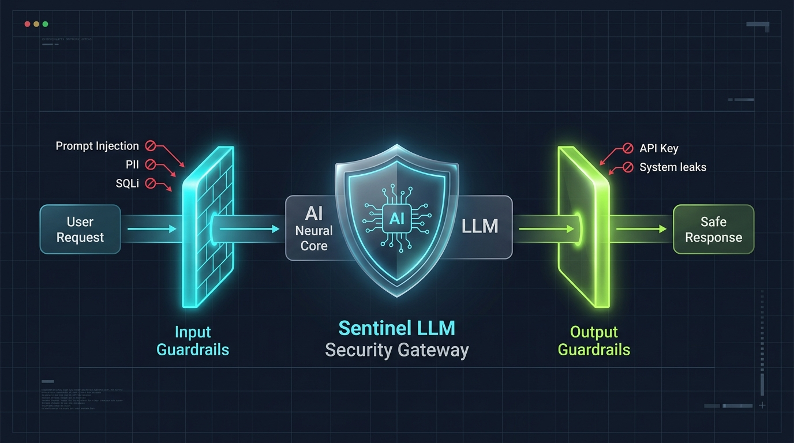

# 🛡️ LLM Security Gateway & SOC Audit Logging



A high-performance, bidirectional security gateway and SOC-ready audit logging middleware designed for Large Language Model (LLM) architectures. Built with **FastAPI**, **Pydantic**, and custom heuristic/algorithmic verification engines.

---

## 🚀 Architecture Overview

```
                                  [ Incoming Request ]
                                           │
                                           ▼
                            ┌──────────────────────────────┐
                            │      INPUT GUARDRAILS        │
                            │  - Prompt Injection/Jailbreak│
                            │  - PII Detection (TCKN/Luhn) │
                            │  - SQLi / Shell Injection    │
                            └──────────────┬───────────────┘
                                           │
                   [ ❌ Violation ]        │ [ ✅ Safe ]
                 ┌─────────────────────────┴────────────────────────┐
                 ▼                                                  ▼
     ┌────────────────────────┐                        ┌────────────────────────┐
     │ HTTP 400 Bad Request   │                        │     LLM API CALL       │
     │ ($0 LLM Token Cost)    │                        │(OpenAI, Claude, Gemini)│
     └────────────────────────┘                        └────────────┬───────────┘
                                                                    │
                                                                    ▼
                                                       ┌────────────────────────┐
                                                       │   OUTPUT GUARDRAILS    │
                                                       │  - System Prompt Leak  │
                                                       │  - API Key/Token Leak  │
                                                       │  - RFC1918 Private IP  │
                                                       │  - Malicious RCE/Link  │
                                                       └────────────┬───────────┘
                                                                    │
                                            [ ❌ Leak ]             │ [ ✅ Safe ]
                                    ┌───────────────────────────────┴──────────┐
                                    ▼                                          ▼
                        ┌────────────────────────┐                 ┌───────────────────────┐
                        │ HTTP 400 Intercepted   │                 │ HTTP 200 Final Answer │
                        └────────────────────────┘                 └───────────────────────┘
                                    │                                          │
                                    └───────────────────┬──────────────────────┘
                                                        ▼
                                           ┌─────────────────────────┐
                                           │   SOC AUDIT LOGGING     │
                                           │    gateway_audit.log    │
                                           └─────────────────────────┘
```

---

## ✨ Features

### 1. 🔍 Input Guardrails
- **Prompt Injection & Jailbreak**: Detects DAN, role-escapes, system overrides, and multi-lingual evasion attempts.
- **PII Protection**:
  - Turkish ID Number (**TCKN**) verification via Mod10 checksum algorithm.
  - Credit Card detection with **Luhn Algorithm** validation.
  - Email addresses & US Social Security Numbers (**SSN**).
- **Harmful Commands / Script Injection**: SQL Injection (`UNION`, `OR 1=1`, `DROP`), reverse shells, Powershell bypasses, and XSS tags.

### 2. 📤 Output Guardrails
- **System Prompt / Rule Leakage**: Prevents confidential developer rules from being extracted.
- **Credential & Internal IP Defense**: Intercepts leaked OpenAI/AWS/JWT tokens and private network IPs (`10.x`, `192.168.x`, `127.0.0.1`, Cloud Metadata `169.254.169.254`).
- **Malicious Payload Interception**: Blocks hallucinated RCE commands (`os.system`, `eval`) and executable download links.

### 3. 📊 SOC / SIEM Ready Audit Logging
Every event is appended to `gateway_audit.log` in JSON Lines format with:
- `event_id` (UUID)
- `timestamp` (ISO 8601 UTC)
- `input_hash` (SHA-256 for integrity and privacy)
- `risk_score` (0.0 to 100.0)
- `response_status` (`ALLOWED`, `BLOCKED_INPUT`, `BLOCKED_OUTPUT`)
- `stage` & `latency_ms`

---

## ⚡ Quick Start

### Installation
```bash
git clone https://github.com/YOUR_USERNAME/llm-security-gateway.git
cd llm-security-gateway
pip install fastapi uvicorn pydantic requests
```

### Running the API Server
```bash
uvicorn security_gateway:app --reload --port 8000
```
API Documentation will be available at: `http://localhost:8000/docs`

---

## 🧪 Comprehensive Verification Suite

The repository includes a 103-scenario full test suite covering unit tests, API integration attacks, edge cases, and audit log verification.

Run all tests:
```bash
python test_full.py
```

### Test Results
```text
  +-----------------------------+----------+----------+----------+
  | Category                    | Passed   | Failed   |  Total   |
  +-----------------------------+----------+----------+----------+
  | Unit Tests                  |     37   |      0   |     37   |
  | API Integration             |     50   |      0   |     50   |
  | Endpoint & Error Handling   |      7   |      0   |      7   |
  | SOC Audit Log Verification  |      9   |      0   |      9   |
  +-----------------------------+----------+----------+----------+
  | OVERALL TOTAL               |    103   |      0   |    103   |
  +-----------------------------+----------+----------+----------+

  Success Rate : 100.0%
  Execution Time : ~0.18 seconds
```

---

## 📄 License
MIT License
